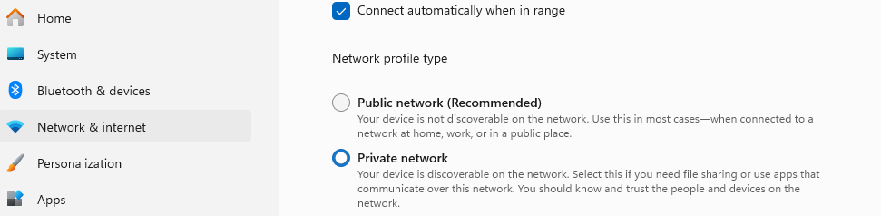

# Getting Started

1. Clone the repository: **`git clone https://github.com/rickmez/miro-clone.git`**
2. Navigate to the project directory: **`cd miro-clone`**
3. Install dependencies: **`npm install`**
4. Build the project: **`npm run build`**
5. Start the project: **`npm start`**

## **Connecting your phone**

If you are using windows you can check your network profile type on the settings app. If it's checked on "Public network" and you want to connect your phone to your localhost project check the "Private Network" option to make your computer discoverable, mind you, you should only do this if you trust your network, and never in a public network unless you know what you're doing

